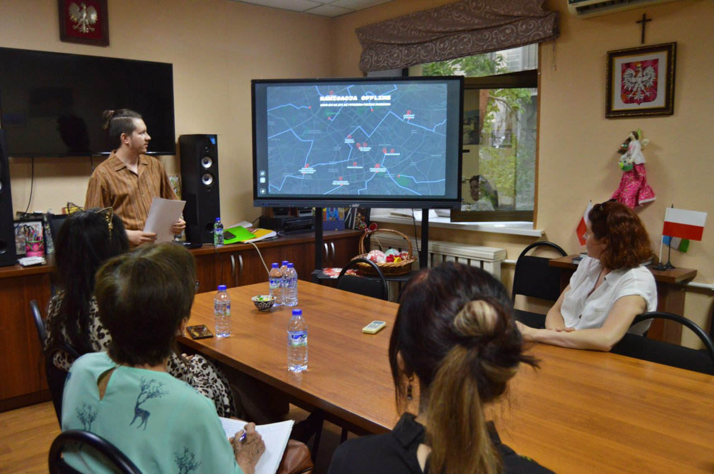
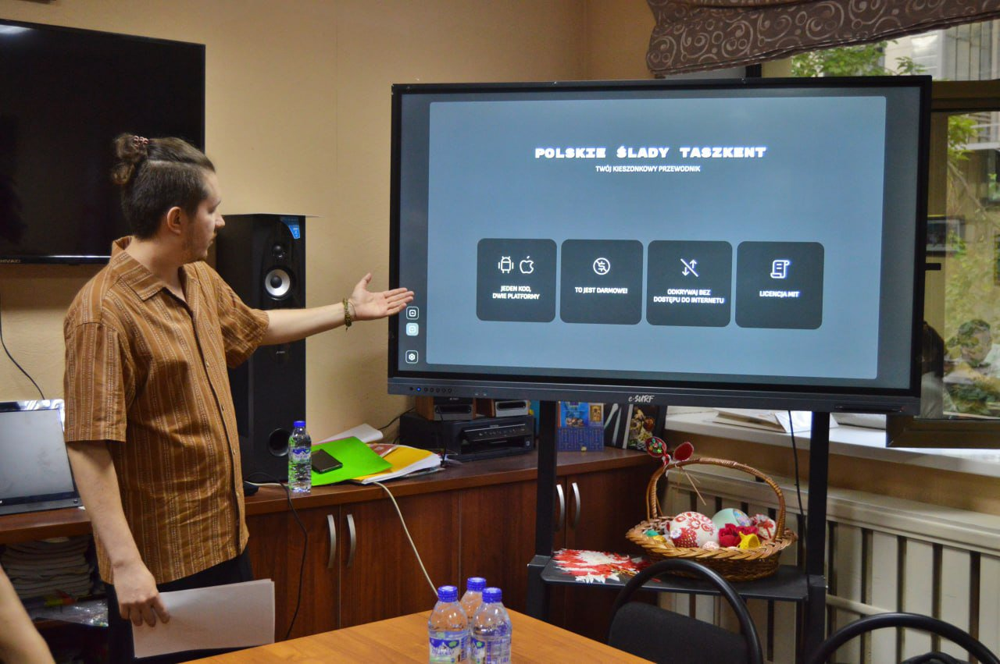
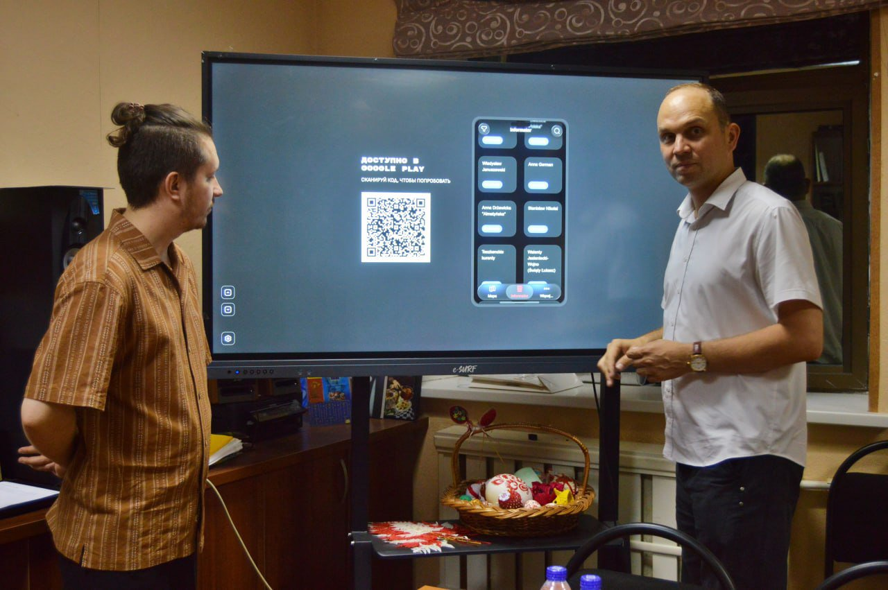

# Polskie Ślady Taszkent — Storytelling

A companion presentation app built to showcase [Polskie Ślady Taszkent](https://github.com/Ko2doo/polskie-slady-taszkent)
on a large-format 4K interactive display during a live public presentation at the
**Polish Cultural Center "Świetlica Polska"** in Tashkent (June 2026).

🔗 **[Live Demo](https://ko2doo.github.io/polskie-slady-storytelling-preview/)**

The event was covered by **Polonijna Agencja Informacyjna** — a Polish diaspora press
agency — in a [full article](https://pai.media.pl/pai_wiadomosci.php?id=44227) and a [Facebook post](https://www.facebook.com/100072381157661/posts/1055541836868512/)

## What it does

Instead of just demoing the main app on a phone, this project turns the presentation itself into an
interactive exhibit. Navigation is deliberately simple — two buttons, back/forward — stepping through a
sequence of vertical slides built with GSAP. Each slide is paced to match a specific beat of the live talk;
the presentation is intentionally not self-explanatory on its own, it only makes sense alongside the
presenter's narration.

There's also a lock screen: while the audience takes their seats (roughly a 5-minute window), the display
shows an interactive clock with the date instead of any presentation content, with an "unlock" button. This
was a deliberate choice to keep the exhibit hidden from curious eyes until the presenter unlocks it by hand
at the right moment.

At the right point in the slide sequence, the presentation hands off to a live, fully working instance of
the main app itself — embedded and interactive right there on the big screen.

## How it's built

npm workspaces monorepo with two independent Svelte 5 apps:

- **`apps/demo-app`** — a full preview instance of Polskie Ślady Taszkent (map, locales, data, point-to-point navigation), built
  standalone and served inside the presentation
- **`apps/storytelling`** — the GSAP-driven narrative layer (i18next for multilingual delivery) that
  embeds `demo-app` via iframe and paces the story to match the live talk

The two apps build independently; `scripts/copy-demo.mjs` then copies the compiled `demo-app` output into
`storytelling`'s build so the whole thing ships as a single static deploy artifact.

## Stack

Svelte 5 · Vite · GSAP · TypeScript · i18next · npm workspaces

## Photos

  
  
  

<em>Live presentation at the Polish Cultural Center "Świetlica Polska", June 2026</em>

